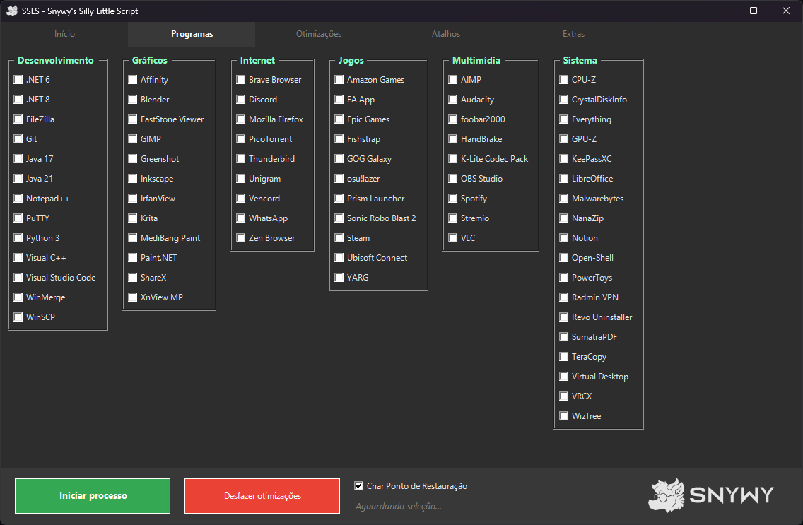
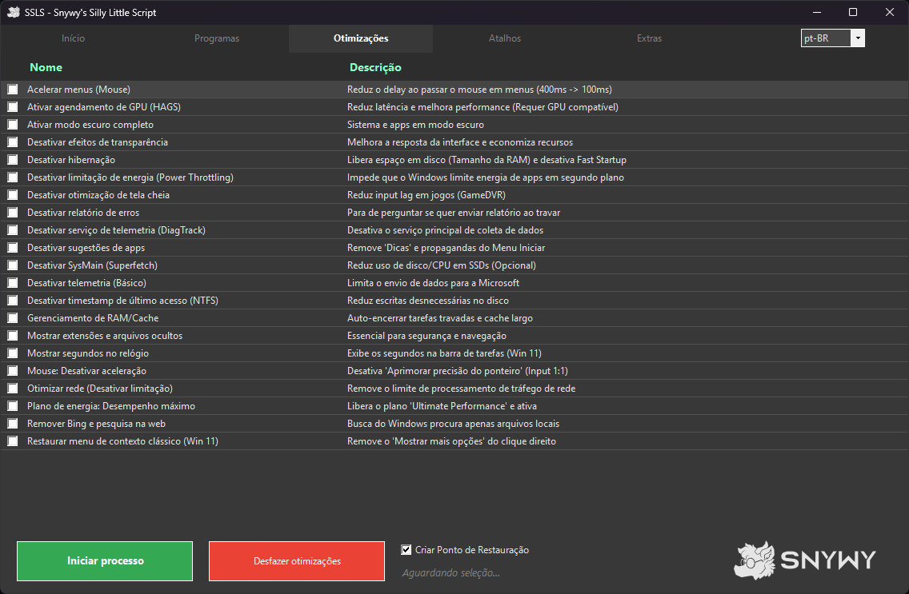

# SSLS - Snywy's Silly Little Script

  

Um utilitário de automação modular em PowerShell projetado para configurar o Windows 11 (e 10) rapidamente após uma formatação. Instale seus programas favoritos, aplique otimizações de sistema e acesse atalhos úteis com facilidade.

> **Nota:** Este projeto está em desenvolvimento e é destinado para "uso ultra-pessoal", moldado especificamente para minhas necessidades. Atualizações serão raras e focadas apenas no que eu uso, então não espere suporte frequente ou novos recursos genéricos.

  
  

## 🚀 Funcionalidades

* **Instalação em Massa (Estilo Ninite):** Selecione múltiplos programas de uma lista curada e instale tudo de uma vez via `winget`.
* **Tweaks de Sistema (Windows 11 Ready):**
  * Restauração do Menu de Contexto Clássico.
  * Modo de Desempenho Máximo (Ultimate Performance) e Power Throttling.
  * Debloat (Remoção de Bing, Telemetria, Relatório de Erros e Sugestões).
  * Otimizações de Input Lag (Mouse, Tela Cheia e HAGS).
  * Ajustes de Privacidade, Rede e Visual (Modo Escuro, Transparência).
* **Atalhos Rápidos:** Acesso direto a configurações profundas do Windows (Ativação, Apps Padrão, etc.).
* **Extras e Manutenção:**
  * Executor de comandos manuais.
  * Criação automática de Ponto de Restauração antes de aplicar mudanças.
* **Recurso de Reversão (Undo):** Aplicou um tweak e não gostou? O script possui um botão dedicado para **desfazer** as alterações.
* **Multi-idioma:** Suporte a troca de idioma em tempo real via arquivos JSON.

## 🛠️ Como Usar

Não é necessário instalar dependências manualmente (o script verifica e instala o `winget` se necessário).

1. Baixe o executável **`SSLS_Setup.exe`** mais recente na aba [Releases](https://github.com/realsnywy/SSLS/releases).
2. Execute o instalador.
   * O script solicitará permissões de Administrador automaticamente para realizar as modificações.
3. Navegue pelas abas, selecione os Softwares ou Otimizações desejadas.
4. Clique no botão **Iniciar** (Verde) para aplicar.

## 📦 Softwares Incluídos

A lista utiliza o repositório oficial do Windows Package Manager (Winget) e inclui softwares das seguintes categorias:

* **Internet** (Navegadores, Comunicação)
* **Multimídia** (Players, Editores de Áudio)
* **Gráficos** (Editores de Imagem, Ferramentas 3D)
* **Jogos** (Launchers, Otimizadores)
* **Dev** (IDEs, Git, Node, Python)
* **Sistema** (Compactadores, Ferramentas de ISO, Drivers)

## ⚠️ Aviso Legal

Este script altera configurações do registro do Windows e instala softwares de terceiros. Embora tenha sido testado para ser seguro e inclua opções de reversão, **use por sua conta e risco**. O script tenta criar um Ponto de Restauração automaticamente antes de aplicar alterações por segurança.

---
*Feito para tornar a formatação menos dolorosa.*
